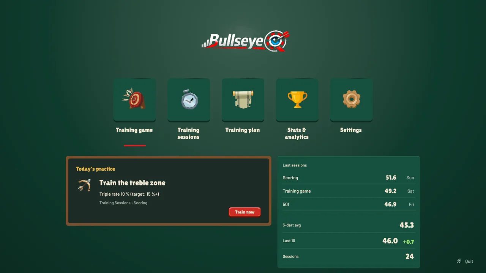
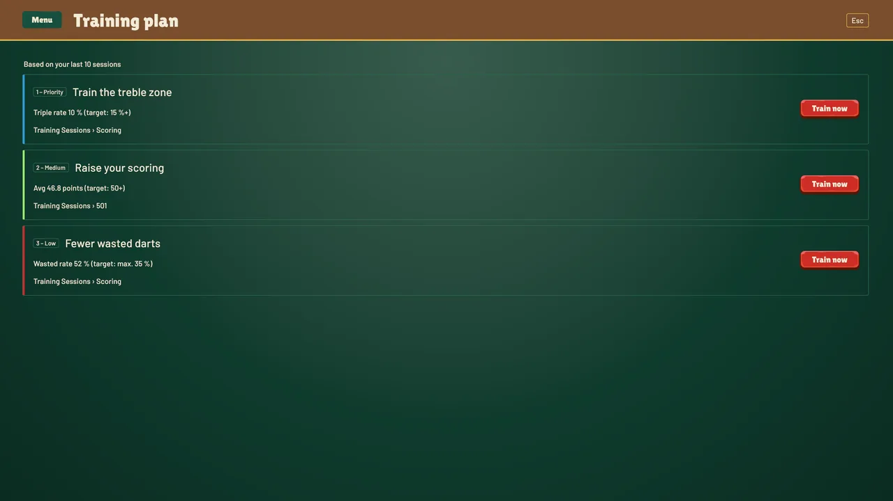
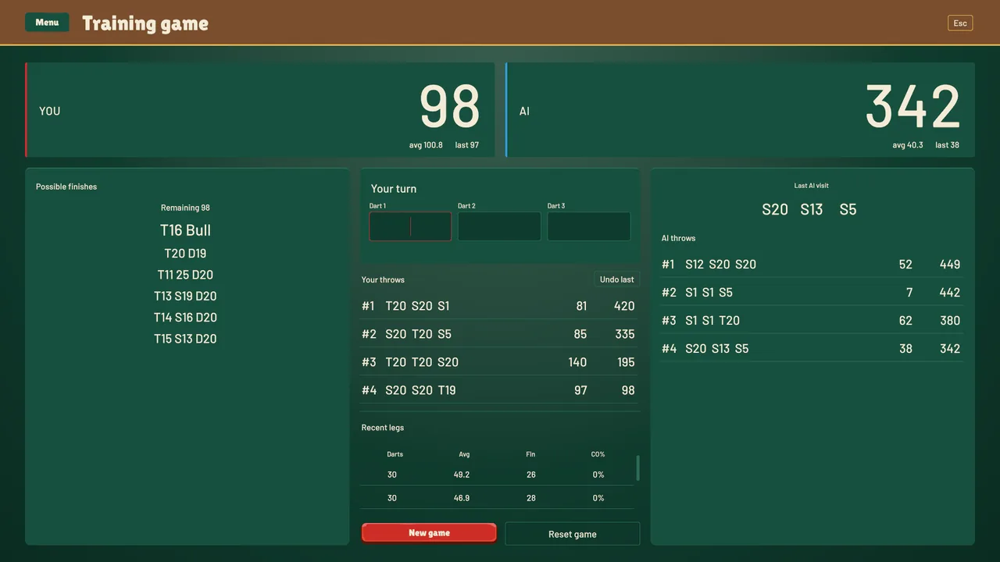
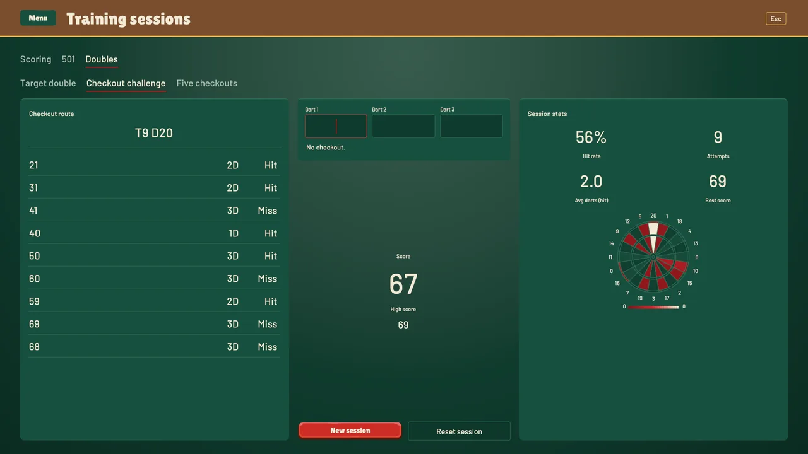
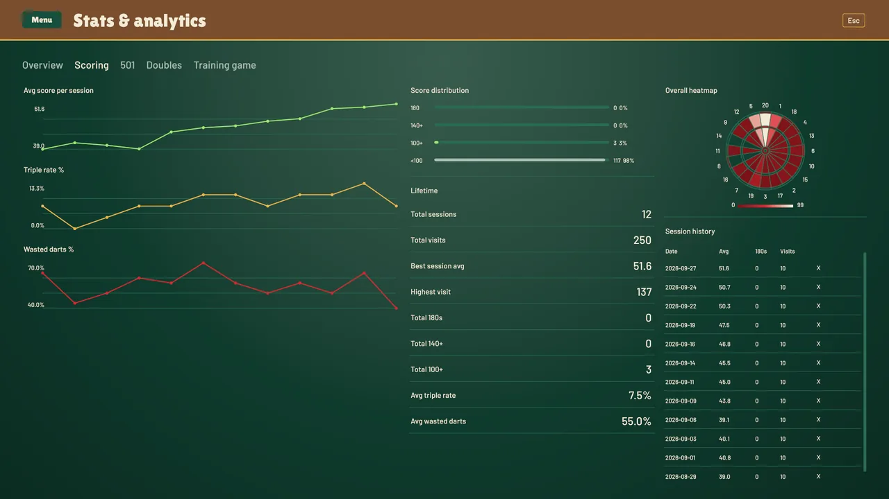

# BullseyeQ

**A darts training app that evaluates every throw and tells you which drill will help most next.**
Built in Unity 6 (C#, UI Toolkit).



| | |
|---|---|
| **My role** | Solo developer. Darts domain logic, metrics and thresholds, data model, UI layout and theme. Built together with a coding agent. |
| **Stack** | Unity 6000.4 · C# · UI Toolkit (UXML/USS, custom `VisualElement`s via `Painter2D`) · Newtonsoft JSON · NUnit EditMode tests |
| **Tests** | 565 EditMode test cases in 20 test classes |
| **Portfolio page** | [thinkshark.de – BullseyeQ](https://thinkshark.de/projekt-bullseyeq.html) |

---

## What it does

- **Four training areas:** scoring, 501, doubles/checkouts, and a 501 training match against a computer opponent.
- **Darts metrics from raw throws:** three-dart average, wasted-darts rate, checkout rate; a dartboard heatmap shows where the darts actually land, line charts show the trend across sessions.
- **Rule-based training plan:** from three completed sessions onwards the analyzer names the most important weak spot, the matching training mode, and the number the recommendation follows from.
- **Drills as game modes:** a checkout chart with all possible routes plus dedicated modes such as *Five Checkouts* and *Checkout Challenge*.
- **Adaptive opponent:** the DartAI calibrates its T20 rate and checkout rate to the player's last five legs (±10 % variance on T20, none on checkouts).

| Training plan | 501 match vs. DartAI | Checkout Challenge | Scoring stats |
|---|---|---|---|
|  |  |  |  |

## Architecture

```
GameManager
  └── DataManager (runtime state)
        ├── PlayerProfile (JSON-persisted)
        │     └── TrainingSession[]  (polymorphic: Scoring / 501 / Checkout)
        └── CurrentSession

UI (UIDocument)
  ├── DartInputController  → session, overview and stats presenters
  ├── FiveOhOneController  → FiveOhOneStatsPresenter
  ├── CheckOutController   → CheckOutStatsPresenter
  └── SettingsController
```

| Path | Contents |
|---|---|
| `Assets/_Project/Scripts/` | Controllers, presenters, `DartAI`, `CheckoutChart`, training-plan analyzer, custom UI elements |
| `Assets/_Project/Scripts/Data/` | Session and profile model, stats recalculation |
| `Assets/_Project/UI/` | UXML layouts and USS theme |
| `Assets/_Project/Tests/EditMode/` | NUnit EditMode tests |

**Key decisions**

- **Deterministic analysis.** Recommendations come from a small set of researched threshold tiers (e.g. average below 35 / below 50 points, wasted rate above 45 % against a 35 % target), not from a model. The same throw data always yields the same recommendation.
- **Presenter pattern.** Controllers talk to presenters only; no UI binding inside domain logic.
- **Immutable session stats.** Stats are computed in one place (`RecalculateStats()`), setters are private and serialised via `[JsonProperty]`.
- **Polymorphic persistence.** Newtonsoft JSON with type names, covered by a JSON round-trip test.
- **Unity-free domain logic.** `DartAI`, `CheckoutChart` and the rules are plain C#, which keeps them fast to test.
- **Custom charts.** Dartboard heatmap and line chart are custom UI Toolkit elements drawn with `Painter2D`.

## Input format

| Input | Meaning |
|---|---|
| `20` | single 20 |
| `20+` | treble 20 |
| `20-` | double 20 |
| `25` | bull (25) |
| `25-` | bullseye (50) |

## Tests

565 EditMode test cases in 20 classes, from domain logic (analyzer, checkout chart, 501 session) and the JSON round trip of stored data to UI contracts.

- In the editor: *Window → General → Test Runner → EditMode → Run All*.
- Batch mode (Unity closed): `bash run-tests.sh` → writes `test-results.xml` and `unity-test.log`. Adjust the `UNITY=` path to your install.

## Build and run

1. Open the folder in Unity Hub with **Unity 6000.4.0f1**.
2. Import the third-party packs listed below.
3. Open `Assets/_Project/Scenes/Dart App.unity` and press Play.

**Not included (licensed per seat, not redistributable):** the UI sprites from Layer Lab's *GUI-TheStone* pack, Odin Inspector, Hot Reload and Wingman. The project code does not depend on the editor tools. Without the GUI-TheStone pack the UI renders without its sprites and `ArtAssetTests` fails.

## What I learned

BullseyeQ was my test bed for working with a coding agent in Unity: which parts can be built that way, and how. The real hurdle came before the code — without a researched yardstick a three-dart average is just a number. I now know better what I have to think through myself first and what I can hand over.
